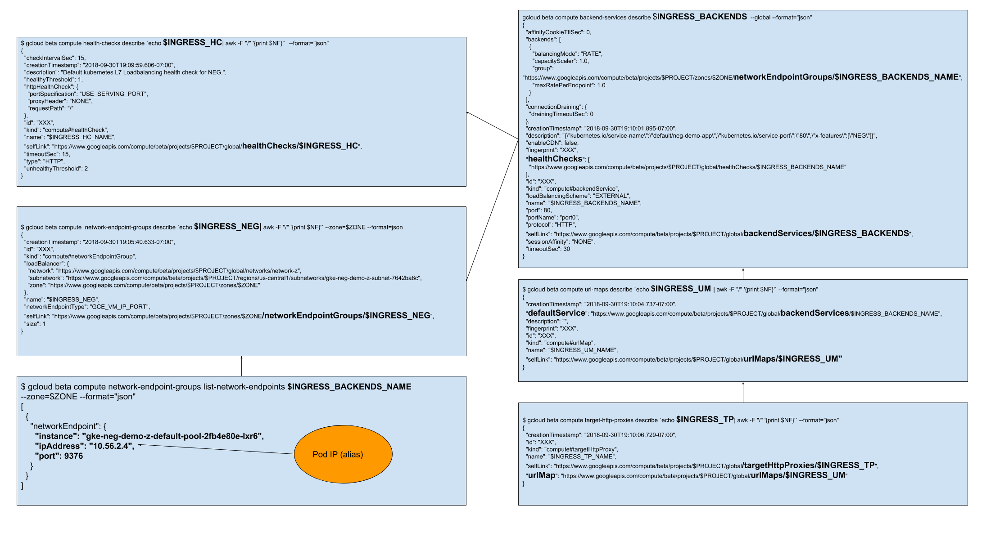

# troubleshooting-gcp-neg

A little note about [NEGs](https://cloud.google.com/kubernetes-engine/docs/how-to/container-native-load-balancing)

- [troubleshooting-gcp-neg](#troubleshooting-gcp-neg)
  - [Pre-Requesite Variables](#pre-requesite-variables)
  - [Pre-Requesite Setup Networking](#pre-requesite-setup-networking)
    - [Create network](#create-network)
    - [Create subnet](#create-subnet)
  - [Create a container native (Ingress powered by NEG)](#create-a-container-native-ingress-powered-by-neg)
    - [Debugging](#debugging)
  - [Create a test instance](#create-a-test-instance)

## Pre-Requesite Variables

```shell
CLUSTER_REGION=us-central1
CLUSTER_ZONE=$CLUSTER_REGION-a

# find appropriate version by
gcloud container get-server-config --zone $CLUSTER_ZONE
CLUSTER_NAME=neg-demo-z
CLUSTER_VERSION=1.10.6-gke.4
```

## Pre-Requesite Setup Networking

We create a network. We will ask GKE to create a subnet inside this network.
However for launching our own instances we need our own subnet

### Create network

```shell
gcloud beta compute networks create --subnet-mode=custom network-z
```

### Create subnet

```shell
gcloud beta compute networks subnets create subnet-z \
--network network-z \
--range 10.128.0.0/16 \
--secondary-range=containerrange1=192.168.0.0/16 \
--region $CLUSTER_REGION
```

## Create a container native (Ingress powered by NEG)

```shell
gcloud container get-server-config --zone $CLUSTER_ZONE

gcloud beta container clusters create $CLUSTER_NAME \
  --cluster-version="$CLUSTER_VERSION" \
  --service-account=$GKE_SA \
  --enable-ip-alias \
  --enable-cloud-logging \
  --enable-cloud-monitoring \
  --create-subnetwork="" \
  --network=network-z \
  --zone=$CLUSTER_ZONE

gcloud container clusters get-credentials $CLUSTER_NAME --zone $CLUSTER_ZONE

kubectl run neg-demo-app --image=k8s.gcr.io/serve_hostname:v1.4 --port=9376 --overrides='{"apiVersion": "apps/v1beta1", "spec": { "minReadySeconds": 60, "template": {"spec": {"terminationGracePeriodSeconds": 90}}}}' --replicas=1

kubectl expose deployment neg-demo-app --port=80 --target-port=9376 --type=ClusterIP
kubectl annotate service neg-demo-app cloud.google.com/neg='{"ingress": true}'

cat <<EOF | kubectl create -f -
apiVersion: extensions/v1beta1
kind: Ingress
metadata:
  name: neg-demo-ing
spec:
  backend:
    serviceName: neg-demo-app
    servicePort: 80
EOF
```

### Debugging



```shell
INGRESS_BACKENDS_NAME=`kubectl get ing/neg-demo-ing  -o jsonpath='{.metadata.annotations.ingress\.kubernetes\.io/backends}' |  awk -F[:{}\"] '{print $3}'`

INGRESS_BACKENDS=`gcloud beta compute backend-services list --format="value(selfLink)" --filter="name=$INGRESS_BACKENDS_NAME"`
gcloud beta compute backend-services describe $INGRESS_BACKENDS  --global --format="json"

INGRESS_UM=`gcloud beta compute url-maps list --format="value(selfLink)" --filter="defaultService=$INGRESS_BACKENDS"`
gcloud beta compute url-maps describe `echo $INGRESS_UM| awk -F "/" '{print $NF}'` --format="json"

INGRESS_TP=`gcloud beta compute target-http-proxies list --format="value(selfLink)"  --filter="urlMap=$INGRESS_UM"`
gcloud beta compute target-http-proxies describe `echo $INGRESS_TP| awk -F "/" '{print $NF}'` --format="json"

INGRESS_FW=`gcloud beta compute forwarding-rules list --format="value(selfLink)"  --filter="target=$INGRESS_TP"`
gcloud beta compute forwarding-rules describe `echo $INGRESS_FW| awk -F "/" '{print $NF}'` --format="json" --global

INGRESS_HC=`gcloud beta compute backend-services describe $INGRESS_BACKENDS_NAME --global --format='value(healthChecks)'`
gcloud beta compute health-checks describe `echo $INGRESS_HC| awk -F "/" '{print $NF}'`  --format="json"

INGRESS_NEG=`gcloud beta compute backend-services describe $INGRESS_BACKENDS_NAME  --global --format="csv[no-heading](backends[].group)"`
ZONE=`gcloud beta compute  network-endpoint-groups list --format="csv[no-heading](loadBalancer.zone.basename())" --filter="selfLink=${INGRESS_NEG}"`
NETWORK=`gcloud beta compute  network-endpoint-groups list --format="csv[no-heading](loadBalancer.network.basename())" --filter="selfLink=${INGRESS_NEG}"`
gcloud beta compute  network-endpoint-groups describe `echo $INGRESS_NEG| awk -F "/" '{print $NF}'` --zone=$ZONE

gcloud beta compute backend-services get-health $INGRESS_BACKENDS_NAME --global --format="json"
gcloud beta compute network-endpoint-groups list-network-endpoints $INGRESS_BACKENDS_NAME --zone=$ZONE --format="json"
```

